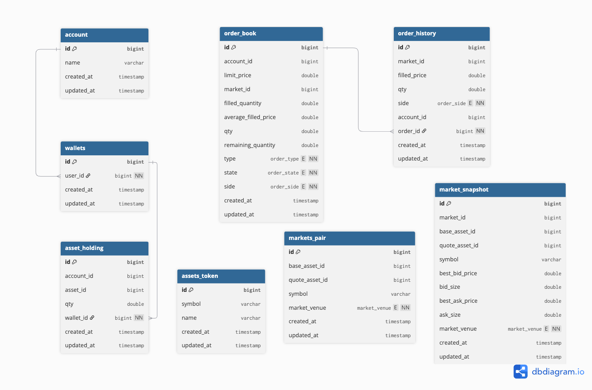

# Trading System

Aquariux Technical Interview

### Project Overview

- Java 17
- SpringBoot version 3.2.2
- [H2 Database](http://localhost:8081/h2-console)
- [Swagger UI](http://localhost:8081/swagger-ui/index.html#/)
- Maven

### Database Structure



Mock data once application starts

#### Account

```
Name: nhatpl
Wallet: 500,000 USDT // Bumped x10 from original request due to BNB and ETH are expensive
```

#### Assets Token

```
BTC, Bitcoin
ETH, Ethereum
USDT, Tether
```

#### Market Pair

```
BTCUSDT
ETHUSDT
```

### Running Locally

```
mvn clean spring-boot:run
```

The app starts on `http://localhost:8081`.

### H2 Console

- URL: `http://localhost:8081/h2-console`
- JDBC URL: `jdbc:h2:mem:tradingdb_dev`
- User: `sa`
- Password: (empty)

### API Base Path

All APIs are under `/api/v1`.

### Sample Requests

Get latest aggregated price:

```
GET /api/v1/market-data/latest?symbol=BTCUSDT
```

Get wallet balance:

```
GET /api/v1/wallets/balance?accountId=1
```

Create a market order:

```
POST /api/v1/orders
Content-Type: application/json

{
  "accountId": "1",
  "symbol": "BTCUSDT",
  "side": "BUY",
  "type": "MARKET",
  "quantity": "0.01"
}
```

### Notes

- Market data is polled on a schedule and stored as snapshots.
- Swagger UI is available at `http://localhost:8081/swagger-ui/index.html#/`.
